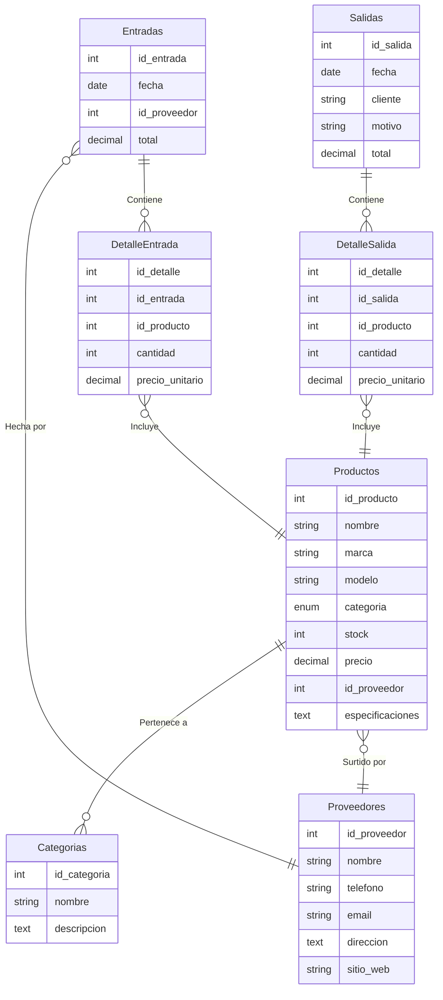

>[!Check] Hecho

Modelo conceptual

```mermaid
erDiagram
    Productos {
        int id_producto
        string nombre
        string marca
        string modelo
        enum categoria
        int stock
        decimal precio
        int id_proveedor
        text especificaciones
    }
    Categorias {
        int id_categoria
        string nombre
        text descripcion
    }
    Proveedores {
        int id_proveedor
        string nombre
        string telefono
        string email
        text direccion
        string sitio_web
    }
    Entradas {
        int id_entrada
        date fecha
        int id_proveedor
        decimal total
    }
    DetalleEntrada {
        int id_detalle
        int id_entrada
        int id_producto
        int cantidad
        decimal precio_unitario
    }
    Salidas {
        int id_salida
        date fecha
        string cliente
        string motivo
        decimal total
    }
    DetalleSalida {
        int id_detalle
        int id_salida
        int id_producto
        int cantidad
        decimal precio_unitario
    }

    Productos ||--o{ Categorias : "Pertenece a"
    Productos }o--|| Proveedores : "Surtido por"
    Entradas }o--|| Proveedores : "Hecha por"
    Entradas ||--o{ DetalleEntrada : "Contiene"
    DetalleEntrada }o--|| Productos : "Incluye"
    Salidas ||--o{ DetalleSalida : "Contiene"
    DetalleSalida }o--|| Productos : "Incluye"

```

[[Modelo entidad relacion]]
[[Descripción del Modelo ER Conceptual]]